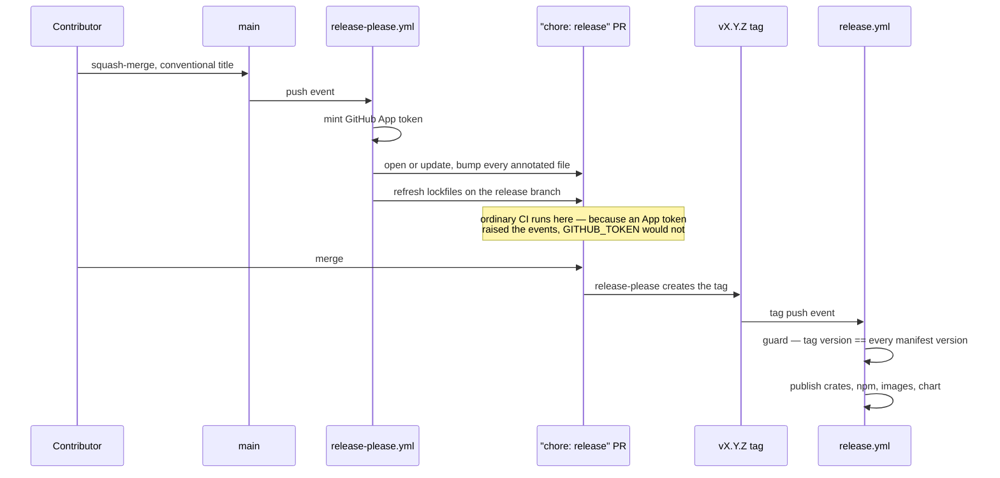
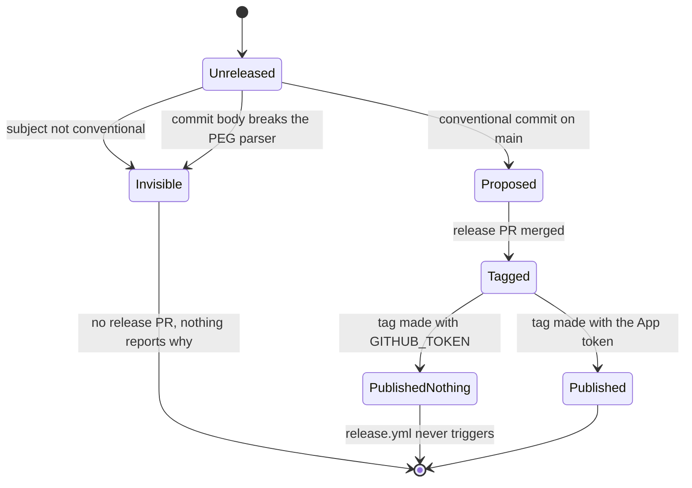

# Releasing, org-wide

How every repository in `vaam-apps` cuts a release, and — more usefully — the
list of ways this has already gone wrong. Every failure below actually
happened here, most of them on 2026-09-18, and each one shares a shape: a
mechanism that looked configured, reported success, and did nothing.

This document is the source of truth. The reference implementation is
[`vaam-apps/vsms`](https://github.com/vaam-apps/vsms) — copy from that repo's
real files, not from memory and not from the snippets here, which will drift.

## The shape



The lifecycle, and where it silently stops:



Both `Invisible` and `PublishedNothing` are **green**. Nothing fails. That is
the whole reason this document exists.

## What a repo needs

Five things. Fewer than five and it is not wired up, whatever the CI says.

| File | Does |
|---|---|
| `release-please-config.json` | Which files carry a version, and how the changelog is grouped |
| `.release-please-manifest.json` | The current version. release-please owns this — never hand-edit |
| `.github/workflows/release-please.yml` | Opens and maintains the release PR |
| `.github/workflows/pr-title.yml` | Refuses a non-conventional PR title, and parses the squash message |
| `ci/commit-message-parse/` | The squash-message parser, pinned to release-please's own grammar |

Repos that publish artifacts also need `release.yml`, triggered on `v*.*.*`.

**No secrets to set up.** `RELEASE_PLEASE_APP_CLIENT_ID` and
`RELEASE_PLEASE_APP_PRIVATE_KEY` are organization secrets with
`visibility: all`. Every repo, public or private, already has them.

## The traps

### 1. `GITHUB_TOKEN` makes a release that publishes nothing

GitHub raises **no workflow events** for anything done with the default
`GITHUB_TOKEN` — deliberate loop prevention. So a release-please run using it
creates the `vX.Y.Z` tag and `release.yml` never fires. No images, no
packages, no chart, and **nothing anywhere fails** to say so. The release PR
also gets no CI at all, which is the same class of gap as a workflow that only
triggers on push-to-`main`: its first execution of changed code is after merge.

Mint an App token with `actions/create-github-app-token` and use it for every
write. Note the input is **`client-id`** — the `Iv23li…` Client ID, not the
numeric App ID; `app-id` is deprecated and they are different values on the
same settings page.

There is deliberately **no fallback** to `GITHUB_TOKEN`. A fallback produces
exactly the silent publish-nothing release above.

**Scope the token.** `create-github-app-token` with no permission inputs mints
a token carrying **every permission the App installation holds org-wide** —
here that is actions, issues, security-events, workflows and more — into a job
that only opens a PR and pushes a branch. zizmor flags this as `github-app`,
and it is a real over-scope rather than a false positive:

```yaml
- uses: actions/create-github-app-token@bcd2ba49218906704ab6c1aa796996da409d3eb1 # v3.2.0
  with:
    client-id: ${{ secrets.RELEASE_PLEASE_APP_CLIENT_ID }}
    private-key: ${{ secrets.RELEASE_PLEASE_APP_PRIVATE_KEY }}
    permission-contents: write
    permission-pull-requests: write
```

Those two are all release-please needs — open and update the release PR, push
its branch, create the tag.

### 2. A bare string in `extra-files` is not a "generic" updater

This one destroyed files. `extra-files` accepts bare strings, and
release-please then **infers an updater from the file extension**:

| extension | updater it picks |
|---|---|
| `.json` | `GenericJson('$.version')` **+** `Generic` |
| `.yaml` / `.yml` | `GenericYaml('$.version')` **+** `Generic` |
| `.toml` | `GenericToml('$.version')` **+** `Generic` |
| `.xml` | `GenericXml('/*/version')` **+** `Generic` |
| anything else | `Generic` alone |

`GenericYaml` reparses and re-serialises the whole document. In the sibling
`vpay` repo that turned a 48-line `Chart.yaml` into 13 lines — every comment
destroyed, the wrong `version:` key bumped (0.2.0 → 0.1.1, a **downgrade**, and
the one field the config deliberately excluded), and `appVersion` left
untouched because the annotation had just been serialised away.

**Always write the object form**, which routes to `Generic` alone whatever the
extension:

```json
{ "type": "generic", "path": "deploy/docker-compose.yml" }
```

For JSON, name the path explicitly instead:

```json
{ "type": "json", "path": "package.json", "jsonpath": "$.version" }
```

`vaam-apps/vsms` escaped this by luck, not design: its two `.yaml` entries are
compose files, and a modern compose file has no top-level `version:` key, so
`GenericYaml('$.version')` found nothing to change. Add one and the luck runs
out.

### 3. The annotation rewrites the line, and only its first semver

`Generic` matches `x-release-please-version` on a line and then performs a
single replace of the **first** semver-shaped substring on it:

```yaml
image: ghcr.io/vaam-apps/vsms/sms-gateway:v0.4.0 # x-release-please-version
```

If the first semver on the line is not the one you mean — a pinned base image,
a port that looks like a version — it silently corrupts. Check every line
before annotating it.

A version in a file the config does not list, or a versioned line with no
annotation, simply never moves. Nothing reports it. In `vsms` that is guarded
by `cargo xtask release-versions`, which fails a PR when the 22 version
references disagree, when a listed `extra-file` has no annotation left in it,
and when a versioned image default has no annotation. A repo without an xtask
should still check what it can.

### 4. A non-conventional commit subject is ignored, not rejected

release-please reads commit **subjects**. A subject it does not recognise
contributes nothing: no changelog entry, no version bump. **No release PR
appears and nothing says why.**

When this was introduced, 58 of the previous 60 subjects on `vsms` were
invisible to it.

So: `pr-title.yml` refuses a non-conventional PR title, and the repository's
squash setting must be **`PR_TITLE`**, not `COMMIT_OR_PR_TITLE`. Under the
latter, a single-commit PR takes *its commit's* subject as the squash subject,
so a conventional title can be bypassed by a PR whose one commit was titled
anything — the lint passes and the release still never sees it.

**And `PR_TITLE` only governs squash merges.** Measured across this org on
2026-09-19: `vsms` and `vpay` both had `PR_TITLE` set correctly *and* still
allowed merge commits and rebase merges — as did all seven other repos. A
merge-commit or rebase merge lands the branch's **individual commit subjects**
on `main`; the PR title never becomes a commit subject at all. So a branch of
`wip:` commits merged that way gives release-please nothing it will act on,
`pr-title.yml` passes, and `ci/commit-message-parse/` validates a squash
message that was never created.

Setting `PR_TITLE` without also disabling `allow_merge_commit` and
`allow_rebase_merge` leaves the bypass wide open. Nothing in CI can see which
merge button someone pressed, so this is a repository setting or it is not
enforced at all.

**Closed 2026-09-19**: all **ten** repos are squash-only. Ten, not nine — the
first sweep covered the nine public repos and missed `vaam-apps/vaam-apps`,
which is private. That is the second time in two days an enumeration of this
org came up one or more short; prefer `gh repo list vaam-apps` over any list
written down, including this sentence. The canonical shape,
which `sync-repo-settings` should assert rather than leave to memory:

| setting | value |
|---|---|
| `allow_squash_merge` | `true` |
| `allow_merge_commit` | `false` |
| `allow_rebase_merge` | `false` |
| `squash_merge_commit_title` | `PR_TITLE` |
| `squash_merge_commit_message` | `COMMIT_MESSAGES` |

`COMMIT_MESSAGES` matters as much as `PR_TITLE`: it is what produces the body
that `ci/commit-message-parse/` reconstructs and parses. Change it and that
check starts validating a message shape that no longer occurs.

### 5. A commit *body* can discard the whole commit

Worse than 4, because the subject is fine. release-please uses
`@conventional-commits/parser`, a strict PEG parser. A body line that *begins*
with `identifier(` reads to that grammar as a type-and-scope header, so nested
parentheses inside it are a syntax error — and the entire commit is dropped:

```text
❯ commit could not be parsed: 7ef89ec fix(ci): …
❯ error message: Error: unexpected token '(' at 8:30, valid tokens [)]
❯ commits: 0
✔ No commits for path: ., skipping
```

The workflow **reported success.** That commit was the only one since the last
release, so no release was proposed at all.

| body line | parses? |
|---|---|
| `see A(B(c)) here` | yes — a word precedes it |
| `A(b) here` | yes — nothing nests |
| `A(B(c)) here` | **no** — line-initial and nested |
| `` `A(B(c))` here `` | **no** — a backtick does not help |

`ci/commit-message-parse/` reconstructs the squash message and parses it with
the **exact pinned version** release-please uses (`@conventional-commits/parser`
`0.4.1`). A looser range is the one way this check could confidently report a
verdict that does not match reality.

It checks the **squash result**, not each commit — branches legitimately carry
`wip:` commits, and a first cut that checked each one rejected 24 of the last
40 on `main`. A guard that loud gets deleted rather than obeyed.

### 6. The release workflow's own version guard can read empty

`release.yml` compares the tag against every manifest version. In `vsms` it did
that with an anchored `sed`:

```bash
sed -n 's/^version = "\(.*\)"$/\1/p'
```

Then the annotation was added, and the line became:

```toml
version = "0.3.2" # x-release-please-version
```

which no longer ends with `"`. The pattern matched nothing, the variable came
out **empty**, the comparison failed, and `v0.3.2` published **no image, no
chart and neither SDK**. The only trace was one line in a log nobody reads on
a green day:

```text
tag=0.3.2 workspace= rust-sdk= node-sdk=0.3.2
```

Two facts about how to read a version lived in two files with nothing holding
them together. Make every extraction tolerate trailing content
(`"\([^"]*\)".*$`), and have the version check **run the release workflow's own
extractions** rather than restating them.

### 7. npm Trusted Publishing cannot bootstrap itself

A package name must already exist on the registry before a Trusted Publisher
can be attached to it. For a brand-new package there is nothing to attach to,
so OIDC cannot work and the first publish must be **manual and token-based**.

Symptoms differ and both mislead:

- **`ENEEDAUTH`** — no credential reached npm at all. Neither a token nor OIDC.
  This is what `vaam-apps/vpay` `v0.2.0` hit: every image published, both npm
  packages failed, and neither `@vaam-apps/vpay-sdk` nor
  `@vaam-apps/vpay-stripe-js` had ever existed under any scope.
- **`E404`** — npm masking an unauthorized write as "not found" rather than
  confirming a package exists to an unauthenticated caller. Read it as auth,
  never as a missing package. Run `npm whoami` before chasing anything else.

Two further traps on the manual publish:

- **Never pass `--provenance`.** It only works inside a recognised CI OIDC
  provider and otherwise hard-errors `EUSAGE` — *before uploading anything*.
- **`EOTP`** means 2FA-on-publish. Use an **Automation**-type token, npm's own
  OTP-exempt class for exactly this.

A Trusted Publisher is bound to `owner/repo` plus a workflow filename, so **a
repository rename or transfer breaks it** until the entry is updated. This org
moved twice (`vymalo` → `vaam-store` → `vaam-apps`); each move broke publishing
until someone re-pointed it.

### 8. A version bump moves lockfiles, and CI builds `--locked`

Bumping a workspace version rewrites every `Cargo.lock` that names it, and
`pnpm-lock.yaml` likewise. Production Dockerfiles and CI here build with
`--locked` / `--frozen-lockfile`, so a release PR with stale lockfiles is **red
on arrival**.

`vsms`'s `release-please.yml` handles this by checking out the release branch
after release-please force-pushes it and running `cargo metadata` in the
directory of **every** `Cargo.lock` that `git ls-files` finds — not a hardcoded
list, because a fifth copy of "which Rust roots exist" is the duplicated-list
failure this document keeps describing.

### 9. Concurrency: never cancel a release run

```yaml
concurrency:
  group: ${{ github.workflow }}-${{ github.ref }}
  cancel-in-progress: false
```

Keyed **per ref**, and never cancelling. Two reasons, both load-bearing:

- Every job in `release.yml` either publishes or gates something that does, and
  a publish interrupted halfway is the one failure here that cannot be re-run
  into a clean state.
- Under a **global** key, when a run is pending and a newer one joins the
  group, GitHub **cancels the older pending run**. So a routine push to `main`
  can silently cancel a queued tag release, and the symptom is a release that
  never happened with nothing failing anywhere.

Accepted, and recorded rather than solved: three pushes to `main` in quick
succession still drop the middle run while pending, and two different tags
pushed close together still race for `:latest`. Cut one release at a time.

### 10. Ordering: an example that consumes your own package

A repo whose example app depends on its own published package cannot bump that
dependency in the release PR — the version does not exist on npm until minutes
*after* the PR merges. It is a follow-up commit, every time.

And pnpm's 24-hour `minimumReleaseAge` quarantine will then reject the
freshly-published version. `minimumReleaseAgeExclude` is **silently unread**
under `--ignore-workspace`; `--trust-lockfile` is the documented escape for a
committed, reviewed lockfile.

## Things that are not release-please's fault but break releases anyway

**Markdown lint versus the changelog.** release-please writes one
`### Bug Fixes` heading per release section — correct changelog form, and
exactly what markdownlint's `MD024/no-duplicate-heading` forbids. This broke
every release PR in the org until `lint.yml` grew a default markdownlint config
setting `MD024: siblings_only: true`. Fixed centrally in this repo; nothing
per-repo is needed.

The near-miss is worth keeping: a *minimal* `MD024` config would have been a
regression, because markdownlint configs **replace** rather than extend — it
would have dropped super-linter's `extends: markdownlint/style/prettier` preset
and re-enabled every formatting rule that preset disables, `MD013` line length
included.

**A lint that only sees changed files cannot tell you your untouched files are
clean.** super-linter lints the diff. So `vsms`'s own `release-please.yml`
carried five unpinned actions — `@v3`, `@v5`, `@v7`, `@stable`, `@v2` — in the
workflow that mints a write-scoped App token, and the gate never once looked at
it, because the file had not changed since the gate was adopted. It surfaced
only when another repo copied it and zizmor scanned it as a new file.

Every workflow in every repo that predates the lint's adoption is in that same
position. A `validate-all` run would find them; nothing schedules one.

**A SHA-pinned caller does not receive upstream fixes.** That is the point of
pinning. It also means every fix to a reusable workflow here reaches **nobody**
until each caller is re-pinned, and nothing in this org notices. On 2026-09-18
all nine adopting repos had to be re-pinned **twice**, and both times the need was found
by accident.

## Adding release-please to a repo

1. Copy `release-please-config.json` and `.release-please-manifest.json` from
   `vaam-apps/vsms` and adapt. Set the manifest to the repo's **current**
   version — if it has published releases, match the latest tag, or
   release-please will propose a version that already exists.
2. Enumerate every file carrying a version. Annotate each line with
   `# x-release-please-version` (or `$.version` for JSON) and list it in
   `extra-files` **in object form**. Check each annotated line's first semver.
3. Copy `release-please.yml` and `pr-title.yml`, plus `ci/commit-message-parse/`.
   Drop the lockfile-refresh step if the repo has no lockfile; keep it if it
   has any.
4. Set the repository squash setting to `PR_TITLE`.
5. If the repo publishes artifacts, make `release.yml`'s version guard tolerate
   trailing content on a version line, and have the PR-time check run those
   same extractions.
6. For a repo publishing a **new** npm package, do the manual bootstrap publish
   *before* the first release, then attach the Trusted Publisher.
7. **For a Dart or Flutter package, use `release-type: dart`, not `simple`.**
   A Flutter `pubspec.yaml` reads `version: 1.2.3+45`, where `+45` is the
   Android `versionCode` / iOS `CFBundleVersion` and must increase with every
   store upload. `simple` plus a generic annotation rewrites only the first
   semver on the line, giving `1.3.0+45` — a **stale build number**, which CI
   cannot see and the store rejects at submission. The `dart` updater
   increments it (`src/updaters/dart/pubspec-yaml.ts`, read directly):

   ```js
   const parsedBuild = parseInt(buildNumber);
   if (!isNaN(parsedBuild)) {
     buildNumber = `+${parsedBuild + 1}`;
   ```

   It is also an anchored regex replace, not the reparse-and-reserialise
   `GenericYaml` of trap 2, and it needs no annotation on that file at all.

## What is still not closed

- **Nothing notices a stale reusable-workflow pin.** Both re-pin sweeps on
  2026-09-18 were triggered by accident.
- **Dependabot PRs fail `pr-title`.** There is no `.github/dependabot.yml` in
  most repos; the durable fix is `commit-message.prefix: chore`, which also
  switches on version-update PRs nobody asked for.
- **An annotated line in a file the config does not list** is only caught by a
  whole-tree walk that nothing performs.
- **Nothing enumerates this org reliably except the API.** Two sweeps on
  consecutive days each missed a repo — once two skills repos that had never
  been listed, once the one private repo. Any script that hardcodes the repo
  list will drift; read `gh repo list vaam-apps` instead.
- **Two repos deliberately do not use release-please**: `vpay-skills` and
  `vsms-skills` version by `vYYYY-MM-DD-<upstream-sha>`, assigned when a human
  re-verifies the skills against a specific upstream commit. Their own
  `VERSIONING.md` explains why a semver derived from *this* repo's commit types
  would assert something untrue. That is a considered exception, not a gap —
  do not "fix" it.
